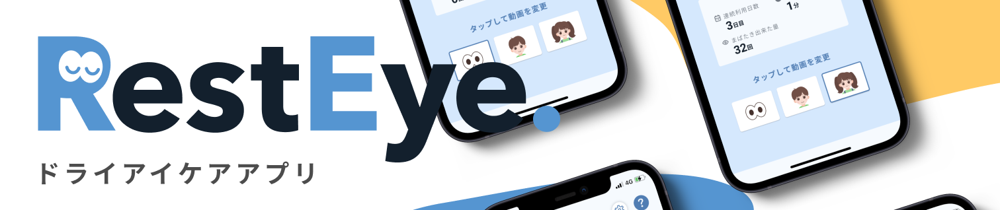
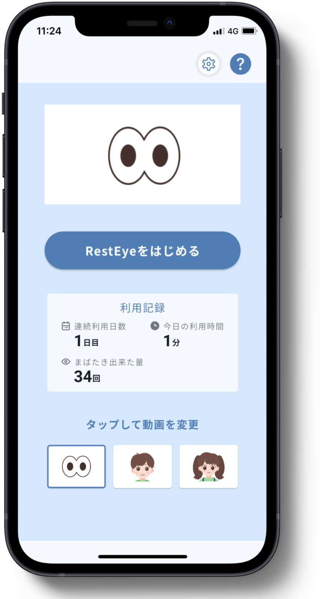
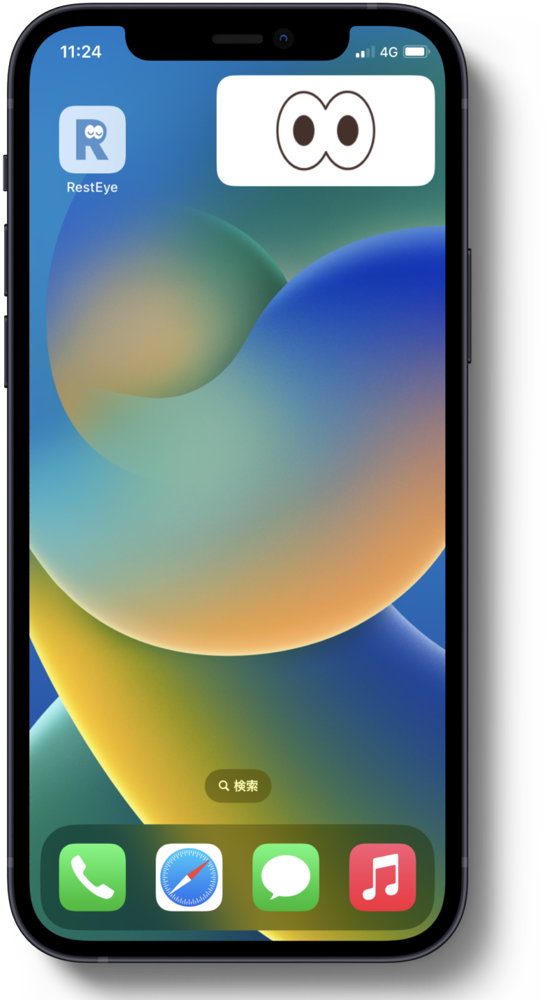

# flutter_resteye

RestEye Client


## App URL

現在は **iOS** のみで配信中

[https://resteye.page.link/app](https://resteye.page.link/app) 

## Design

   

## Features

- Picutre in Picture（以下PinP） を使いドライアイを常に防止することができます。
- PinP を Swift で実装し、Flutter から呼び出すようにしています。
  - 実装詳細としては `UIView` に `CMSampleBuffer` 変換し -> PinP の Buffer に乗せています。
  - Flutter -> Swift の呼び出しには `MethodChannel` データのやり取りには `Shared Preferences` を利用しています。
- PinP は重いので更新回数を減らすことで処理を軽くしています。

## Architecture

### CI/CD


## Development

### 前提

- Firebase SDK が必要
- Dart 2.18.7
- Flutter 3.3.10
- Xcode 14.2
- エディタ

### 初回起動

1. `ios/runner` に `GoogleService-Info.plist` を配置する

```
mv GoogleService-Info.plist path/to/app/ios/Runner/.
```

2. `flutter run` で実行する

```
flutter run \
  --dart-define=RC_SDK_API_KEY_IOS={RevenueCatのAPIキー}
  --dart-define=AD_UNIT_ID_INDEX_BOTTOM={広告ユニットID その１}
  --dart-define=AD_UNIT_ID_SETTING_TOP={広告ユニットID その2}
```


